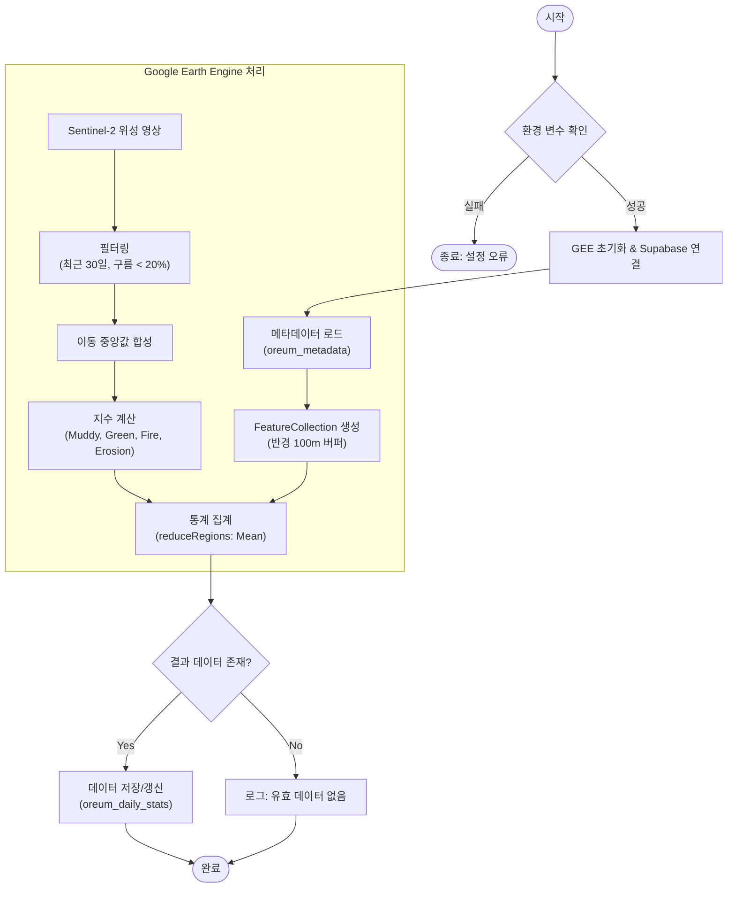

# 오름 위성 데이터 분석 파이프라인

이 문서는 `main.py` 스크립트에 구현된 오름 위성 데이터 분석 및 적재 파이프라인의 구조와 실행 흐름을 시각적으로 설명합니다.

## 데이터 처리 흐름도

## 1. 개요

이 파이프라인은 Google Earth Engine(GEE)을 활용하여 Sentinel-2 위성 이미지를 분석하고, 제주 오름의 환경 지표를 계산하여 Supabase 데이터베이스에 일별 통계로 저장합니다.

## 2. 사전 요구 사항 (환경 변수)

스크립트 실행을 위해 다음 환경 변수가 설정되어 있어야 합니다.

| 변수명 | 설명 |
| :--- | :--- |
| `SUPABASE_URL` | Supabase 프로젝트 URL |
| `SUPABASE_KEY` | Supabase 인증 키 |
| `EE_PROJECT_ID` | Google Earth Engine 프로젝트 ID |
| `EE_SERVICE_ACCOUNT_KEY` | GEE 서비스 계정 키 (JSON 문자열 형식) |

## 3. 상세 처리 단계

### 단계 1: 초기화 및 인증
1.  환경 변수 로드 및 유효성 검사를 수행합니다.
2.  서비스 계정 정보를 사용하여 Google Earth Engine에 인증하고 초기화합니다.
3.  Supabase 클라이언트를 생성하고 연결 상태를 확인합니다.

### 단계 2: 대상지 메타데이터 로드
-   **Source**: Supabase `oreum_metadata` 테이블
-   **Query**: `id`, `x_coord`, `y_coord` 컬럼을 조회합니다.
-   **Transformation**: 조회된 좌표 데이터를 기반으로 반경 100m 버퍼를 가진 GEE `FeatureCollection`을 생성합니다.

### 단계 3: 위성 영상 처리 (GEE)
-   **Dataset**: `COPERNICUS/S2_SR_HARMONIZED` (Sentinel-2 Surface Reflectance)
-   **Filtering**:
    -   기간: 실행일 기준 최근 30일
    -   구름 조건: 구름 피복률(Cloudy Pixel Percentage) 20% 미만
-   **Processing**:
    -   조건에 맞는 이미지들의 중앙값(`median`) 이미지를 생성합니다.
    -   다음 4가지 환경 지수를 계산하여 밴드로 추가합니다:
        1.  **Muddy Index**: `(B3 - B8) / (B3 + B8)`
        2.  **Green Visual Index**: 식생 관련 시각화 지수
        3.  **Fire Risk Index**: 화재 위험도 지수
        4.  **Erosion Index**: 토양 침식 지수

### 단계 4: 통계 집계 (Aggregation)
-   `reduceRegions` 함수를 사용하여 각 오름 영역(Feature) 내의 픽셀 평균값(`mean`)을 계산합니다.
-   분석 해상도(`scale`)는 10m로 설정됩니다.
-   반경(`buffer`)은 100m로 설정됩니다.

### 단계 5: 데이터 저장
-   **Target**: Supabase `oreum_daily_stats` 테이블
-   **Method**: `upsert` (Upsert)
    -   `oreum_id`와 `date` 컬럼을 기준으로 충돌 발생 시 기존 데이터를 갱신합니다.
-   유효한 데이터가 산출된 경우에만 저장을 수행합니다.

### 단계 6 : 위성 DB 기반 AI 학습
-    GPT-4o이든, 어떤 모델이든 자유롭게 학습시키면 됩니다!!

## 4. 데이터베이스 스키마 참조

### 입력: `oreum_metadata`
| 컬럼명 | 설명 |
| :--- | :--- |
| `id` | 오름 식별자 |
| `x_coord` | 경도 좌표 |
| `y_coord` | 위도 좌표 |

### 출력: `oreum_daily_stats`
| 컬럼명 | 설명 |
| :--- | :--- |
| `oreum_id` | 오름 식별자 (Foreign Key) |
| `date` | 분석 날짜 (YYYY-MM-DD) |
| `muddy_index` | 진흙 지수 값 |
| `green_visual_index` | 녹색도 지수 값 |
| `fire_risk_index` | 화재 위험 지수 값 |
| `erosion_index` | 침식 지수 값 |
