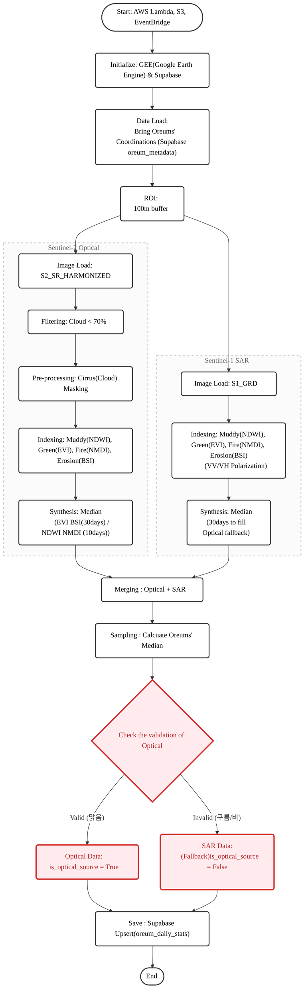

# 제주 오름 위성 데이터 분석 파이프라인 (Jeju Oreum Satellite Analysis Pipeline)

## 1. 개요 (Overview)
이 파이프라인은 제주도 오름의 상태(질척임, 식생, 화재 위험, 침식)를 모니터링하기 위해 **Google Earth Engine (GEE)**을 사용하여 위성 데이터를 분석하고, 결과를 **Supabase** 데이터베이스에 저장하는 서버리스 함수 핸들러입니다.

## 2. 주요 특징 (Key Features)
- **하이브리드 분석 (Hybrid Analysis)**: 기상 상황에 민감한 **광학 위성(Sentinel-2)**과 날씨(구름)에 구애받지 않는 **레이더 위성(Sentinel-1 SAR)** 데이터를 결합하여 데이터 공백(Missing Data)을 최소화합니다.
- **자동 Fallback 로직**: 구름 등으로 인해 광학 데이터가 유효하지 않을 경우, 자동으로 최근 30일간의 SAR 데이터 중앙값으로 대체하여 연속성을 보장합니다.

## 3. 환경 설정 (Environment Setup)
실행을 위해 다음 환경 변수(Environment Variables)가 필요합니다:
- `SUPABASE_URL`: Supabase 프로젝트 엔드포인트 URL
- `SUPABASE_KEY`: Supabase 서비스 롤(Service Role) 또는 인증 키
- `EE_PROJECT_ID`: Google Earth Engine 프로젝트 ID
- `EE_SERVICE_ACCOUNT_KEY`: GEE 서비스 계정의 JSON 키 (문자열 형태)

## 4. 파이프라인 단계 (Pipeline Steps)

### Step 1: 초기화 및 타겟 로딩 (Initialization & Target Loading)
1. **인증**: GEE 서비스 계정 및 Supabase 클라이언트를 초기화합니다.
2. **타겟 조회**: Supabase의 `oreum_metadata` 테이블에서 분석 대상 오름들의 ID와 좌표(`x_coord`, `y_coord`)를 가져옵니다.
3. **영역 설정**: 각 오름 좌표를 중심으로 **반경 100m** 버퍼 영역(Geometry)을 생성하여 분석 영역(ROI)으로 설정합니다.

### Step 2: 위성 데이터 수집 및 전처리 (Data Acquisition & Preprocessing)

#### A. 광학 위성 (Sentinel-2) - "주전 선수 (Primary)"
- **데이터셋**: `COPERNICUS/S2_SR_HARMONIZED`
- **분석 기간**:
  - **장기 지수 (식생, 침식)**: 최근 **30일** (안정성 확보)
  - **단기 지수 (질척임, 화재)**: 최근 **10일** (최신성 반영)
- **처리 과정**:
  1. **필터링**: 구름 낀 픽셀 비율 100% 미만인 이미지만 선별.
  2. **구름 마스킹**: `QA60` 밴드를 사용하여 구름 및 권운 제거.
  3. **지수 계산 (Indices Calculation)**:
     - `s2_muddy`: 정규화된 차이 지수 (수분 관련)
     - `s2_green`: 수정된 식생 지수 (EVI 유사 공식)
     - `s2_fire`: SWIR 기반 화재 위험도
     - `s2_erosion`: 토양 노출 및 침식 관련 지수
  4. **합성 (Composite)**: 지정된 기간 내의 이미지들의 **중앙값(Median)**을 계산하여 대표값 추출.

#### B. 레이더 위성 (Sentinel-1 SAR) - "구원 투수 (Fallback)"
- **데이터셋**: `COPERNICUS/S1_GRD` (IW 모드, VV/VH 편파)
- **분석 기간**: 최근 **30일** (위성 재방문 주기 및 스펙클 노이즈 저감을 위해 긴 기간 설정)
- **처리 과정**:
  1. **지수 계산 (Indices Calculation)**:
     - `sar_muddy`: VV 밴드 기반 수분 추정 및 정규화
     - `sar_green`: RVI (Radar Vegetation Index) 활용
     - `sar_fire`: 수분 지수의 역수 등 활용
     - `sar_erosion`: VV/VH 편파 차이 정규화
  2. **합성 (Composite)**: 30일간 수집된 이미지들의 **중앙값(Median)** 사용.

### Step 3: 데이터 병합 및 통계 추출 (Merge & Reduce)
- Sentinel-2(Optical) 합성 이미지와 Sentinel-1(SAR) 합성 이미지를 하나의 이미지로 병합합니다.
- `reduceRegions` 함수를 사용하여 각 오름의 100m 반경 내 픽셀들의 **평균값(Mean)**을 계산합니다.

### Step 4: Fallback 로직 및 데이터 패키징 (Fallback Logic)
각 오름의 분석 결과에 대해 다음 로직을 수행합니다:

1. **데이터 검증**: 광학 데이터(`s2_muddy` 등)가 존재하는지 확인합니다.
2. **값 결정 (Decision Making)**:
   - **Case 1 (맑음)**: 광학 데이터가 존재하면 `Sentinel-2` 지수 값을 우선 사용합니다.
   - **Case 2 (흐림/구름)**: 광학 데이터가 `null`인 경우, `Sentinel-1` (SAR) 지수 값을 대체(Fallback)하여 사용합니다.
3. **출처 표기**:
   - `is_optical_source`: `True` (광학 사용 시), `False` (SAR 대체 시)

### Step 5: 저장 (Storage)
- 최종 정제된 데이터를 Supabase의 `oreum_daily_stats` 테이블에 저장합니다.
- **Upsert 전략**: `oreum_id`와 `date`가 일치하는 레코드가 있으면 업데이트하고, 없으면 새로 생성합니다.

## 5. 산출 데이터 스키마 (Output Schema)

| 필드명 | 데이터 타입 | 설명 | 비고 |
| :--- | :--- | :--- | :--- |
| `oreum_id` | Integer/UUID | 오름 고유 식별자 | Foreign Key |
| `date` | Date (String) | 분석 기준 날짜 (YYYY-MM-DD) | |
| `muddy_index` | Float | 땅의 질척임 정도 (0.0 ~ 1.0) | 높을수록 질척임 |
| `green_visual_index` | Float | 시각적 녹지/식생 지수 | 높을수록 푸름 |
| `fire_risk_index` | Float | 산불/화재 위험도 | 높을수록 위험 |
| `erosion_index` | Float | 토양 침식 가능성 | 높을수록 위험 |
| `is_optical_source` | Boolean | 데이터 출처 구분 | True: 광학, False: SAR |
